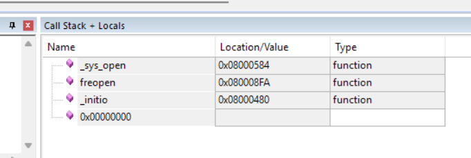
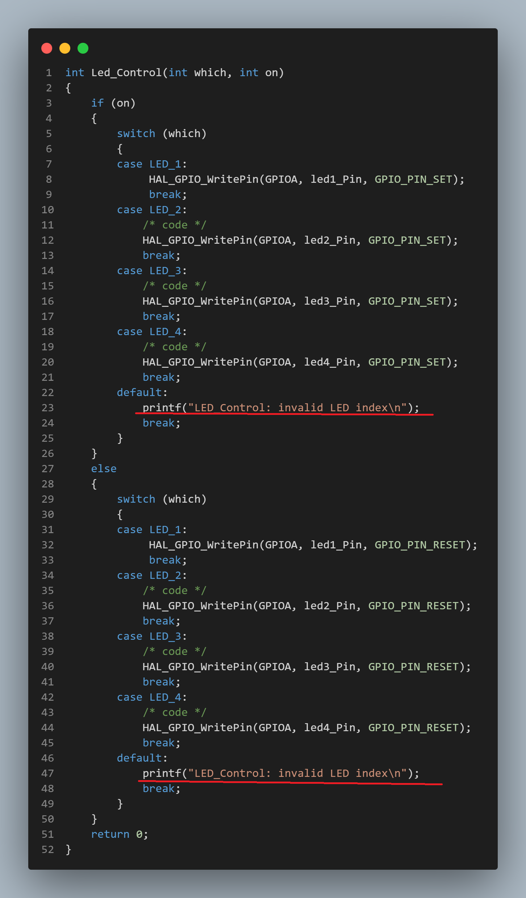
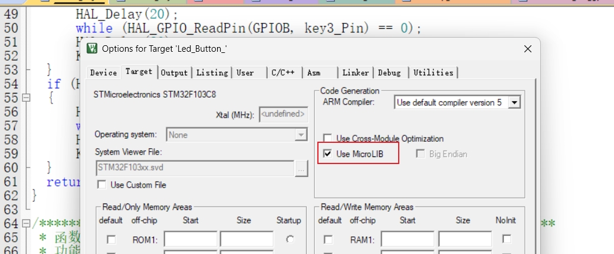
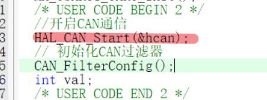

### 问题一：编写key和led驱动调试时全速运行暂停在这里



###### 原因分析：



询问ai得知printf没有重定向可能会造成该问题

###### 解决：

1.keil工程配置MicroLIB



2.添加printf 重定向

```
intfputc(int ch, FILE *f)
{
if(!uart_ready)return ch;
  
HAL_UART_Transmit(&huart1,(uint8_t*)&ch,1,100);
return ch;
}
```

### 问题二：发现CAN接收没有收到消息

###### 原因分析：

没开启CAN通信

###### 解决：


