### 问题一：程序一直在跑空闲任务

###### 原因分析：

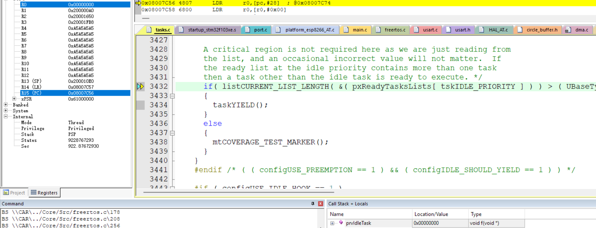

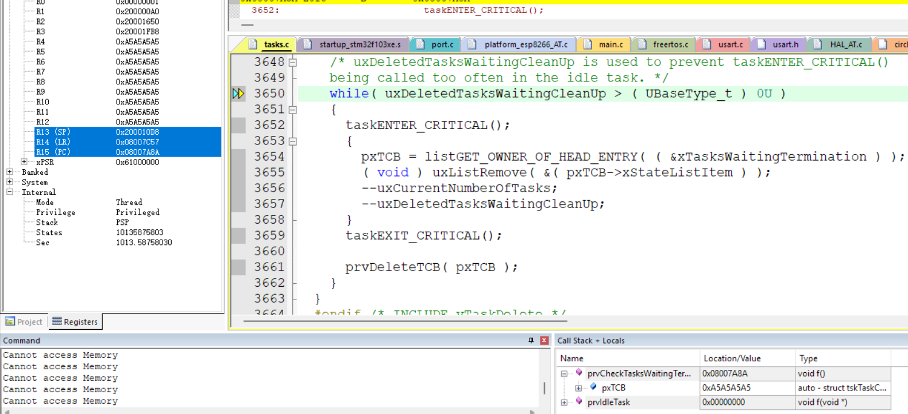

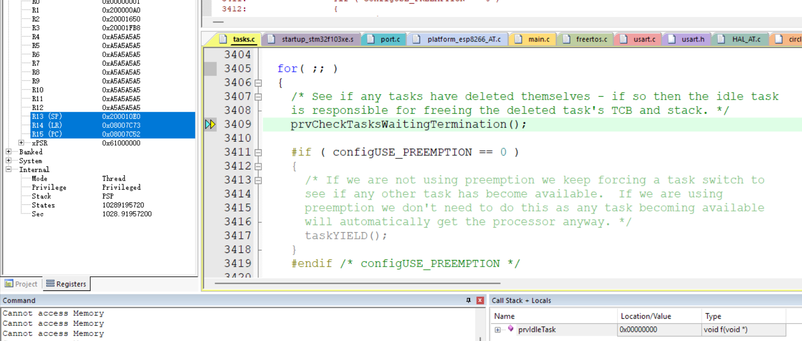

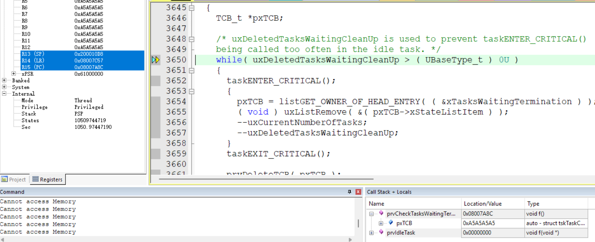

发现一直在循环跑空闲任务

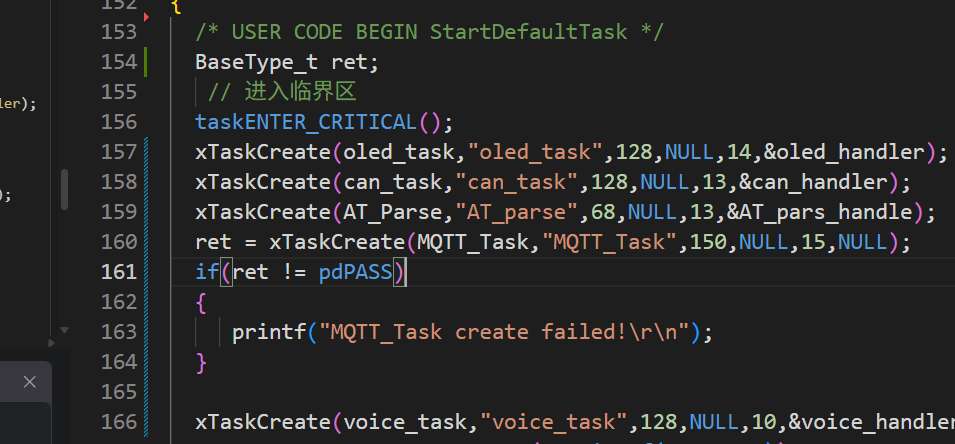

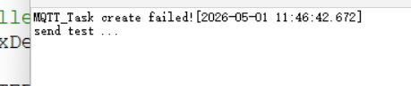

发现任务创建失败

猜测总堆栈空间不够

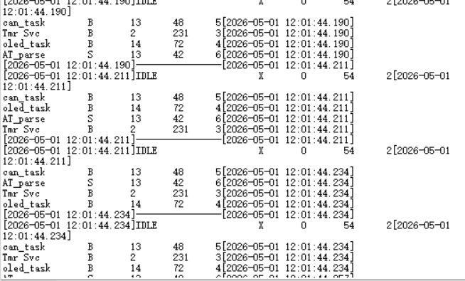

MQTT_task任务没创建

###### 解决：

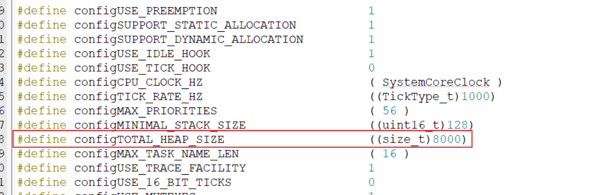

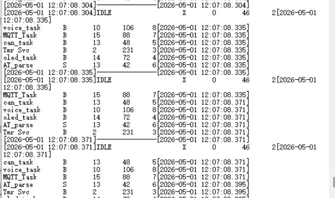

### 问题二：程序一直卡在这里

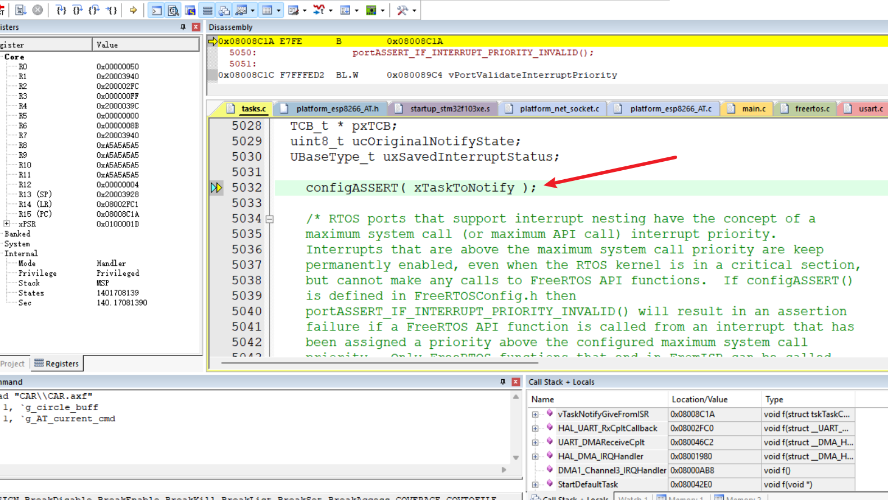

###### 原因分析：

发现 configASSERT中传递的AT_pars_handle是0，导致进入死循环

发现初始化顺序不对，DMA和串口3初始化在任务创建之前

int main(void)
{
  HAL_Init();
  SystemClock_Config();

  // 外设初始化
  MX_GPIO_Init();
  MX_DMA_Init();
  MX_CAN_Init();
  MX_USART3_UART_Init();  // ← 这里初始化USART3
  MX_USART1_UART_Init();
  MX_USART2_UART_Init();

  AT_Init();
  OLED_Init();
  HAL_CAN_Start(&hcan);
  CAN_FilterConfig();

  // FreeRTOS初始化
  osKernelInitialize();
  MX_FREERTOS_Init();  // ← 这里才创建任务，AT_pars_handle才被赋值

  osKernelStart();  // ← 调度器启动后，StartDefaultTask才开始执行
}

###### 解决：

将串口DMA中断开启放在任务里

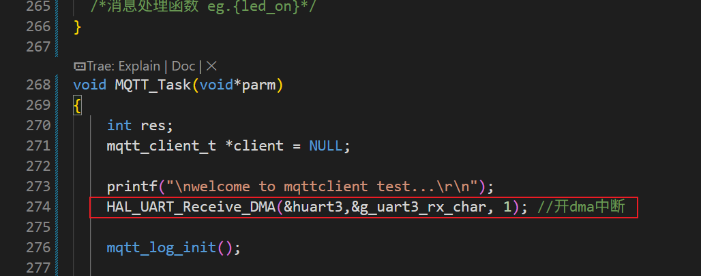

### 问题三：

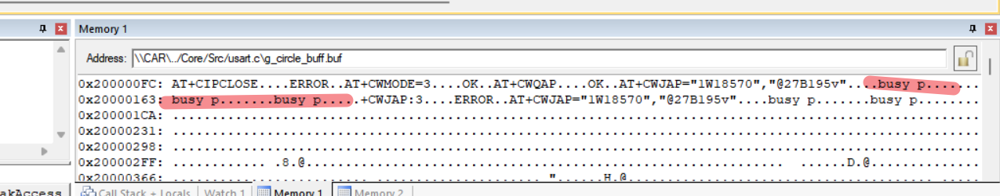

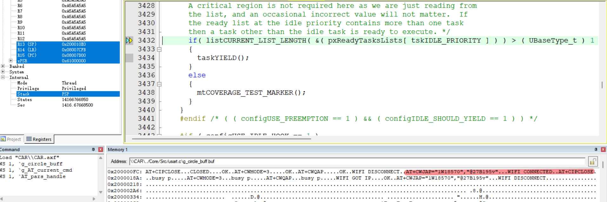

用ESP32-12F芯片AT命令可能和ESP32-01S可能有些差异，mqtt代码是在esp01S写的
