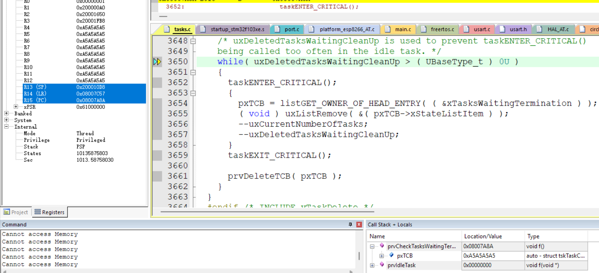
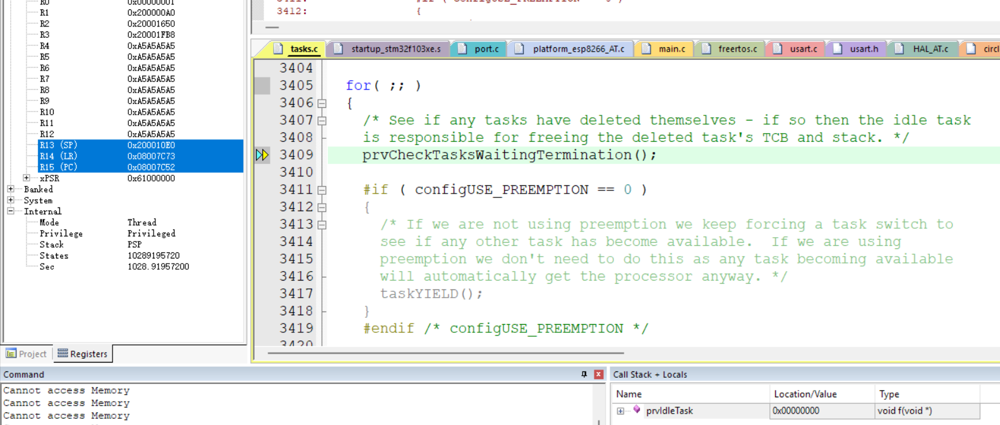
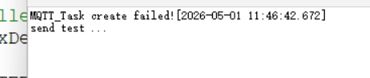
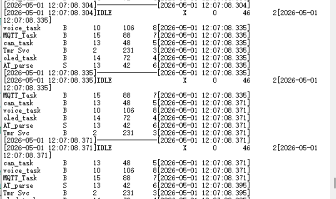
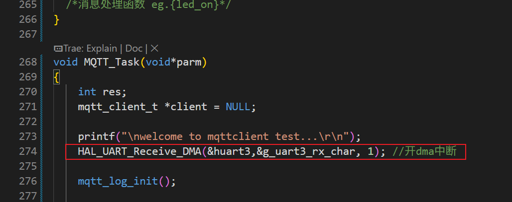
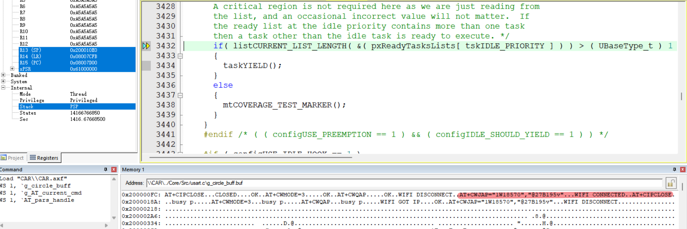
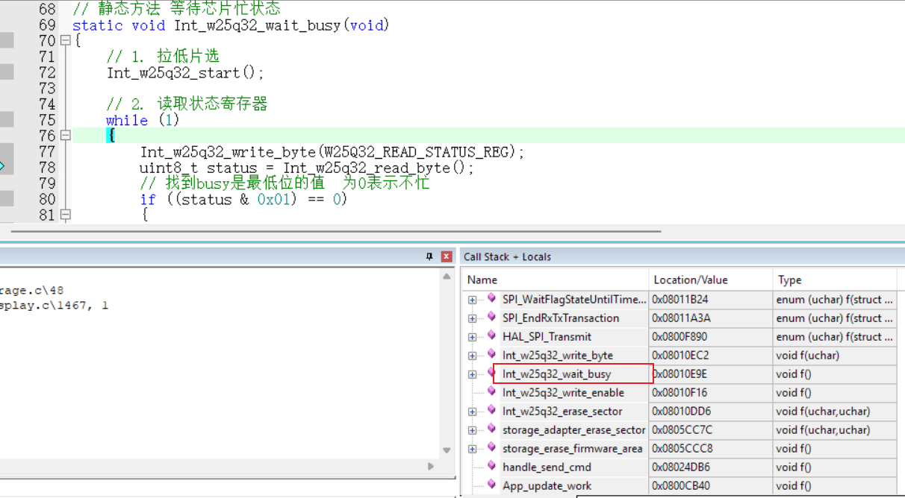
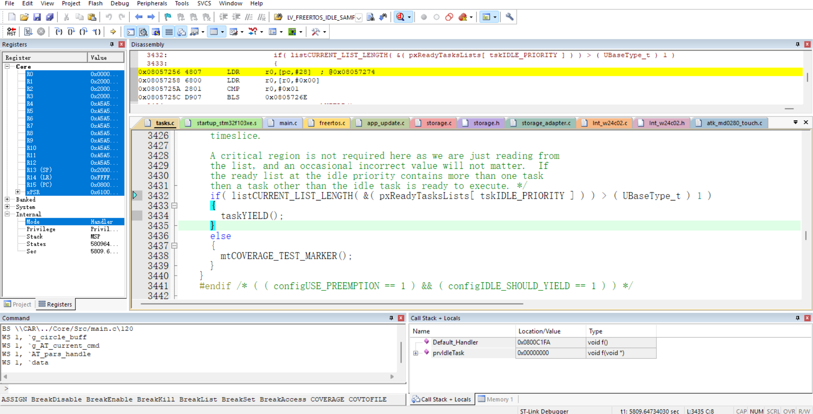

### 问题一：程序一直在跑空闲任务

###### 原因分析：







发现一直在循环跑空闲任务




发现任务创建失败

猜测总堆栈空间不够


MQTT_task任务没创建

###### 解决：




### 问题二：程序一直卡在这里


###### 原因分析：

发现 configASSERT中传递的AT_pars_handle是0，导致进入死循环

发现初始化顺序不对，DMA和串口3初始化在任务创建之前

int main(void)
{
  HAL_Init();
  SystemClock_Config();

  // 外设初始化
  MX_GPIO_Init();
  MX_DMA_Init();
  MX_CAN_Init();
  MX_USART3_UART_Init();  // ← 这里初始化USART3
  MX_USART1_UART_Init();
  MX_USART2_UART_Init();

  AT_Init();
  OLED_Init();
  HAL_CAN_Start(&hcan);
  CAN_FilterConfig();

  // FreeRTOS初始化
  osKernelInitialize();
  MX_FREERTOS_Init();  // ← 这里才创建任务，AT_pars_handle才被赋值

  osKernelStart();  // ← 调度器启动后，StartDefaultTask才开始执行
}

###### 解决：

将串口DMA中断开启放在任务里



### 问题三：AT指令不匹配




用ESP32-12F芯片AT命令可能和ESP32-01S可能有些差异，mqtt代码是在esp01S写的

### 问题四：擦除w25q128时有几率会在这里死循环卡住



###### 解决：

加互斥操作

### 问题五：写入ATC02的更新标志位不对

app程序的IIC无法使用，而bootloader的IIC能正常使用

###### 原因分析：

1.经过测试，单独app程序使用时IIC也使用不了，具体定位到app工程，

2.在app工程main中添加iic测试代码，发现还是没有IIC总线在线

```
peripherals */
  MX_GPIO_Init();
  MX_DMA_Init();
  MX_CAN_Init();
  MX_USART3_UART_Init();
  MX_USART1_UART_Init();
  MX_USART2_UART_Init();
  MX_FSMC_Init();  /* 强制复位 I2C1：bootloader 跳转后外设可能残留非默认状态，HAL_I2C_Init 无法完全恢复，需用 SWRST 硬件复位 */
__HAL_RCC_I2C1_CLK_ENABLE();
SET_BIT(I2C1->CR1, I2C_CR1_SWRST);
CLEAR_BIT(I2C1->CR1, I2C_CR1_SWRST);
MX_I2C1_Init();  /* ---- I2C 诊断：打印寄存器值和设备检测 ---- */
  {
      uint32_t pclk1 = HAL_RCC_GetPCLK1Freq();
      printf("[I2C] PCLK1=%lu Hz | CR2=0x%04lX CCR=0x%04lX TRISE=0x%02lX SR1=0x%04lX SR2=0x%04lX\r\n",
             pclk1,
             I2C1->CR2, I2C1->CCR, I2C1->TRISE,
             I2C1->SR1, I2C1->SR2);
      printf("[I2C] GPIOB_CRL=0x%08lX ODR=0x%08lX IDR=0x%08lX | ENR_APB1=0x%08lX APB2=0x%08lX\r\n",
             GPIOB->CRL, GPIOB->ODR, GPIOB->IDR,
             RCC->APB1ENR, RCC->APB2ENR);      HAL_StatusTypeDef s = HAL_I2C_IsDeviceReady(&hi2c1, 0xA0, 5, 10);
      if (s == HAL_OK)
          printf("[I2C] EEPROM detected OK\r\n");
      else if (s == HAL_TIMEOUT)
          printf("[I2C] EEPROM not responding (TIMEOUT)\r\n");
      else
          printf("[I2C] EEPROM error, status=%d\r\n", s);
  }
  /* ---- I2C 诊断结束 ---- */  MX_SPI2_Init();
  MX_CRC_Init();
  /* USER CODE BEGIN 2 */  OLED_Init();
  HAL_CAN_Start(&hcan);
  CAN_FilterConfig();  /* USER CODE END 2 */  /* Init scheduler /
  osKernelInitialize();  / Call init function for freertos objects (in cmsis_os2.c) */
  MX_FREERTOS_Init();  /* Start scheduler */
  osKernelStart();
```

3.尝试注释MX_FSMC_Init();后发现IIC可以使用，定位到FSMC外设使用

###### 解决：

由于只有OTA升级中用到了IIC，所以在进入OTA升级任务后将LCD屏用的FSMC外设时钟关闭

```
/* 释放 FSMC 总线资源，确保 OTA 更新过程中 I2C 不会冲突 */
	fsmc_deinit_for_i2c(); 
void fsmc_deinit_for_i2c(void)
{
    /* 1. Disable FSMC Bank4 (LCD uses NE4 = Bank4) */
    /*FSMC 控制器 "Bank4 不再需要工作"，FSMC 状态机停止参与 AHB 总线仲裁 */
    FSMC_NORSRAM_DEVICE->BTCR[3] &= ~FSMC_BCRx_MBKEN;

    /* 2. Reset FSMC GPIO pins to default input state */
//    HAL_GPIO_DeInit(GPIOG, GPIO_PIN_0 | GPIO_PIN_12);
//    HAL_GPIO_DeInit(GPIOE, GPIO_PIN_7  | GPIO_PIN_8  | GPIO_PIN_9  | GPIO_PIN_10 |
//                            GPIO_PIN_11 | GPIO_PIN_12 | GPIO_PIN_13 | GPIO_PIN_14 |
//                            GPIO_PIN_15);
//    HAL_GPIO_DeInit(GPIOD, GPIO_PIN_0  | GPIO_PIN_1  | GPIO_PIN_4  | GPIO_PIN_5  |
//                            GPIO_PIN_8  | GPIO_PIN_9  | GPIO_PIN_10 | GPIO_PIN_14 |
//                            GPIO_PIN_15);

    /* 3. Disable FSMC peripheral clock */
    __HAL_RCC_FSMC_CLK_DISABLE();
}
```

### 问题六：USART2接收到数据后进入Default_Handler异常


