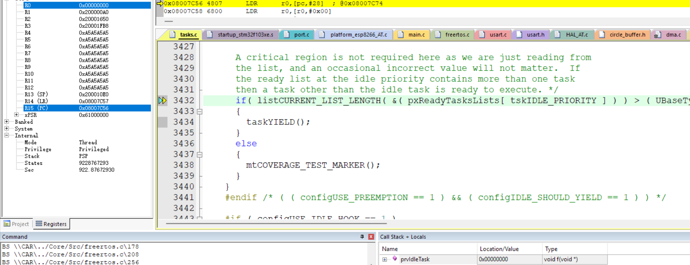
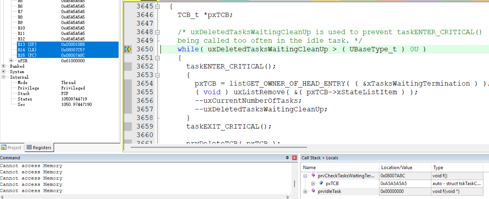
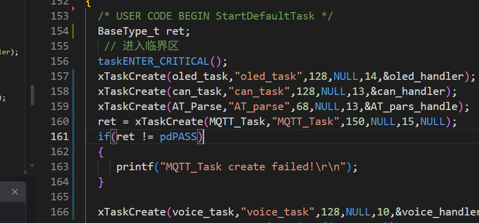
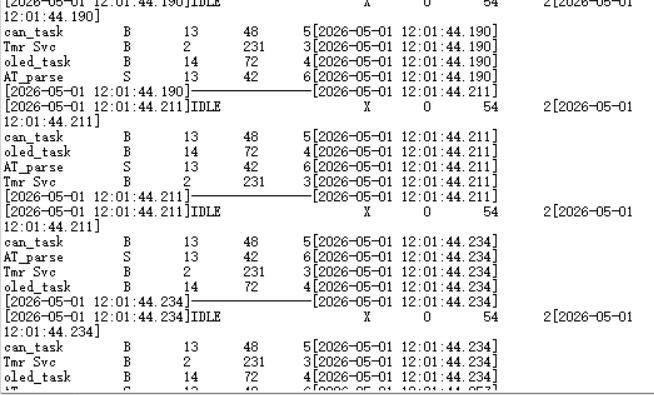
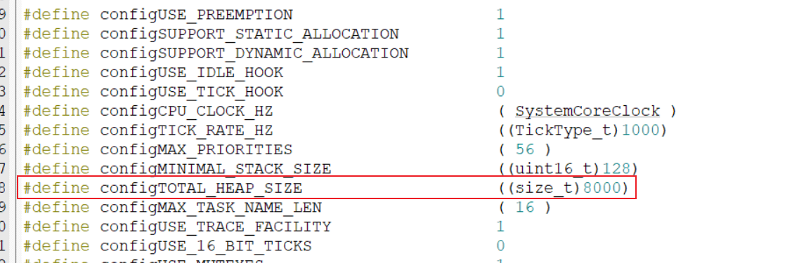
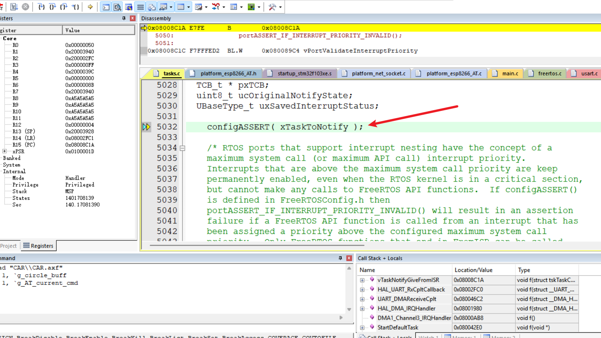
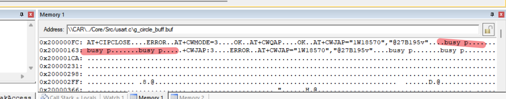
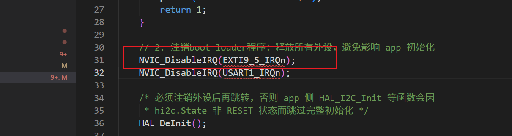
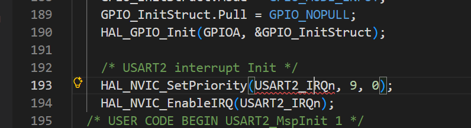
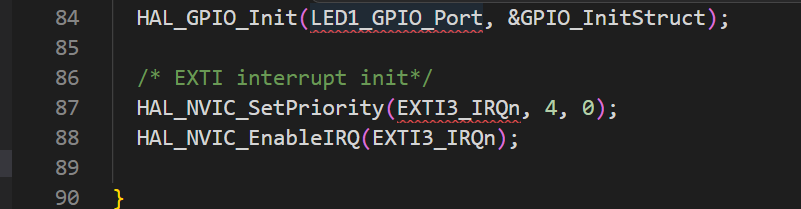

### 问题一：程序一直在跑空闲任务

###### 原因分析：






发现一直在循环跑空闲任务




发现任务创建失败

猜测总堆栈空间不够



MQTT_task任务没创建

###### 解决：




### 问题二：程序一直卡在这里



###### 原因分析：

发现 configASSERT中传递的AT_pars_handle是0，导致进入死循环

发现初始化顺序不对，DMA和串口3初始化在任务创建之前

int main(void)
{
  HAL_Init();
  SystemClock_Config();

  // 外设初始化
  MX_GPIO_Init();
  MX_DMA_Init();
  MX_CAN_Init();
  MX_USART3_UART_Init();  // ← 这里初始化USART3
  MX_USART1_UART_Init();
  MX_USART2_UART_Init();

  AT_Init();
  OLED_Init();
  HAL_CAN_Start(&hcan);
  CAN_FilterConfig();

  // FreeRTOS初始化
  osKernelInitialize();
  MX_FREERTOS_Init();  // ← 这里才创建任务，AT_pars_handle才被赋值

  osKernelStart();  // ← 调度器启动后，StartDefaultTask才开始执行
}

###### 解决：

将串口DMA中断开启放在任务里


### 问题三：AT指令不匹配




用ESP32-12F芯片AT命令可能和ESP32-01S可能有些差异，mqtt代码是在esp01S写的

### 问题四：擦除w25q128时有几率会在这里死循环卡住


###### 解决：

加互斥操作

### 问题五：写入ATC02的更新标志位不对

app程序的IIC无法使用，而bootloader的IIC能正常使用

###### 原因分析：

1.经过测试，单独app程序使用时IIC也使用不了，具体定位到app工程，

2.在app工程main中添加iic测试代码，发现还是没有IIC总线在线

```
peripherals */
  MX_GPIO_Init();
  MX_DMA_Init();
  MX_CAN_Init();
  MX_USART3_UART_Init();
  MX_USART1_UART_Init();
  MX_USART2_UART_Init();
  MX_FSMC_Init();  /* 强制复位 I2C1：bootloader 跳转后外设可能残留非默认状态，HAL_I2C_Init 无法完全恢复，需用 SWRST 硬件复位 */
__HAL_RCC_I2C1_CLK_ENABLE();
SET_BIT(I2C1->CR1, I2C_CR1_SWRST);
CLEAR_BIT(I2C1->CR1, I2C_CR1_SWRST);
MX_I2C1_Init();  /* ---- I2C 诊断：打印寄存器值和设备检测 ---- */
  {
      uint32_t pclk1 = HAL_RCC_GetPCLK1Freq();
      printf("[I2C] PCLK1=%lu Hz | CR2=0x%04lX CCR=0x%04lX TRISE=0x%02lX SR1=0x%04lX SR2=0x%04lX\r\n",
             pclk1,
             I2C1->CR2, I2C1->CCR, I2C1->TRISE,
             I2C1->SR1, I2C1->SR2);
      printf("[I2C] GPIOB_CRL=0x%08lX ODR=0x%08lX IDR=0x%08lX | ENR_APB1=0x%08lX APB2=0x%08lX\r\n",
             GPIOB->CRL, GPIOB->ODR, GPIOB->IDR,
             RCC->APB1ENR, RCC->APB2ENR);      HAL_StatusTypeDef s = HAL_I2C_IsDeviceReady(&hi2c1, 0xA0, 5, 10);
      if (s == HAL_OK)
          printf("[I2C] EEPROM detected OK\r\n");
      else if (s == HAL_TIMEOUT)
          printf("[I2C] EEPROM not responding (TIMEOUT)\r\n");
      else
          printf("[I2C] EEPROM error, status=%d\r\n", s);
  }
  /* ---- I2C 诊断结束 ---- */  MX_SPI2_Init();
  MX_CRC_Init();
  /* USER CODE BEGIN 2 */  OLED_Init();
  HAL_CAN_Start(&hcan);
  CAN_FilterConfig();  /* USER CODE END 2 */  /* Init scheduler /
  osKernelInitialize();  / Call init function for freertos objects (in cmsis_os2.c) */
  MX_FREERTOS_Init();  /* Start scheduler */
  osKernelStart();
```

3.尝试注释MX_FSMC_Init();后发现IIC可以使用，定位到FSMC外设使用

###### 解决：

由于只有OTA升级中用到了IIC，所以在进入OTA升级任务后将LCD屏用的FSMC外设时钟关闭

```
/* 释放 FSMC 总线资源，确保 OTA 更新过程中 I2C 不会冲突 */
	fsmc_deinit_for_i2c(); 
void fsmc_deinit_for_i2c(void)
{
    /* 1. Disable FSMC Bank4 (LCD uses NE4 = Bank4) */
    /*FSMC 控制器 "Bank4 不再需要工作"，FSMC 状态机停止参与 AHB 总线仲裁 */
    FSMC_NORSRAM_DEVICE->BTCR[3] &= ~FSMC_BCRx_MBKEN;

    /* 2. Reset FSMC GPIO pins to default input state */
//    HAL_GPIO_DeInit(GPIOG, GPIO_PIN_0 | GPIO_PIN_12);
//    HAL_GPIO_DeInit(GPIOE, GPIO_PIN_7  | GPIO_PIN_8  | GPIO_PIN_9  | GPIO_PIN_10 |
//                            GPIO_PIN_11 | GPIO_PIN_12 | GPIO_PIN_13 | GPIO_PIN_14 |
//                            GPIO_PIN_15);
//    HAL_GPIO_DeInit(GPIOD, GPIO_PIN_0  | GPIO_PIN_1  | GPIO_PIN_4  | GPIO_PIN_5  |
//                            GPIO_PIN_8  | GPIO_PIN_9  | GPIO_PIN_10 | GPIO_PIN_14 |
//                            GPIO_PIN_15);

    /* 3. Disable FSMC peripheral clock */
    __HAL_RCC_FSMC_CLK_DISABLE();
}
```

### 问题六：USART2接收到数据后进入Default_Handler异常


###### 原因分析：

查阅网上相关资料说是相关中断函数未定义造成

修改.s文件中Default_Handler函数，让它执行

```
/**
 * @brief  增强版 Default_Handler - 打印触发中断的 IRQ 号
 * @note   通过 NVIC->IABR 寄存器（中断挂起位）定位具体中断源
 */
void Default_Handler(void)
{
    uint32_t irq_num = 0;
    for (uint8_t reg = 0; reg < 3; reg++)
    {
        uint32_t pending = NVIC->IABR[reg];
        if (pending)
        {
            irq_num = (reg << 5) + 31 - __CLZ(pending);
            break;
        }
    }
    printf("\r\n[DEFAULT HANDLER] IRQ = %lu\r\n", irq_num);
    printf("  USART2: SR=0x%08lX CR1=0x%08lX\r\n", USART2->SR, USART2->CR1);
    printf("  CAN1  : MSR=0x%08lX ESR=0x%08lX\r\n", CAN1->MSR, CAN1->ESR);
    printf("  System halted.\r\n");
    while (1);
}
```

发现打印信息是这个：

[DEFAULT HANDLER] IRQ = 9
  USART2: SR=0x000000F8 CR1=0x0000202C
  CAN1  : MSR=0x00000C00 ESR=0x04000000
  System halted.

查看中断向量表发现该中断号对于外部中断3，串口2使用PA3接收引脚，很可能是bootloader程序的外部中断3没关。

查看bootloader程序发现确实如此，关闭的是EXTI9_5_IRQn



所以当USART2 的PA3有收到数据时，由于外部中断3优先级高于串口2，会先跳到外部中断3处理函数，而在app程序中没有外部中断3处理函数，所以会执行Default_Handler





###### 解决：

bootloader程序跳转前关闭所有bootloader中使用过的中断

### 问题七：CAN OTA 固件更新 CRC 校验失败

###### 现象：

通过 CAN 总线 OTA 更新固件时，接收端 CRC 校验始终失败：

```
recv cmd
erasing flash...
erase done
send cmd done
can_rec_msg_len:412744
crc check fail: rec=05EDBF1E calc=FBB5E655 len=412744
```

发送端（app_send_ZET6）和接收端（Vehicle_screen_controller）的 CRC 算法、多项式、初始值、字节序、数据长度完全一致，但 CRC 值不同。

###### 原因分析：

**根因：CRC 计算的数据来源不同**

- 发送端从内部 Flash（`0x08008000`）直接计算 CRC
- 接收端先将数据写入 W25Q32 外部 Flash，再从 W25Q32 读回来计算 CRC

两次读取是不同的物理存储设备，W25Q32 的写入或读出只要有一位出错，CRC 就会对不上。

**W25Q32 驱动存在三个缺陷：**

**缺陷一：写入/擦除后没有等待 W25Q32 内部操作完成**

`Int_w25q32_write_data_with_32addr()` 写完数据后直接返回，没有调用 `wait_busy()`。W25Q32 页编程（Page Program）典型耗时 0.7~3ms，如果主循环跑得快，下一页写入可能在上一页还没完成时就开始了，导致数据丢失或写入不完整。擦除函数同理。

```
// 原来的时序：
写页1 → CS拉高 → 立刻返回 → 写页2 → CS拉高 → 立刻返回
                    ↑ W25Q32 还在内部编程，数据丢失！

// 修复后的时序：
写页1 → CS拉高 → wait_busy() → 写页2 → CS拉高 → wait_busy()
                    ↑ 等到 WIP=0             ↑ 等到 WIP=0
```

**缺陷二：逐字节 SPI 读取，速度过慢**

`Int_w25q32_read_data_with_32addr()` 每读一个字节就调用一次 `HAL_SPI_Receive()`，读 412KB 数据需要 422,000+ 次 HAL 函数调用。逐字节读取在大量数据时容易被中断打断，导致 SPI 时序异常读到错误数据。

**缺陷三：`wait_busy()` 没有超时保护**

原来的 `while(1)` 死循环等待 W25Q32 空闲，如果硬件异常会永远卡死。

###### 解决：

修改 `Int_w25q32.c`，修复三个问题：

**1. 写入/擦除后加 `wait_busy()`：**

```c
void Int_w25q32_write_data_with_32addr(uint32_t addr, uint8_t *data, uint16_t len)
{
    Int_w25q32_write_enable();
    Int_w25q32_start();
    // ... 发送命令、地址、数据 ...
    Int_w25q32_stop();
    Int_w25q32_wait_busy();  // ← 新增：等待页编程完成
}

void Int_w25q32_erase_sector(uint8_t block, uint8_t sector)
{
    Int_w25q32_write_enable();
    Int_w25q32_start();
    // ... 发送命令、地址 ...
    Int_w25q32_stop();
    Int_w25q32_wait_busy();  // ← 新增：等待擦除完成
}
```

**2. 读取改为批量 SPI 传输：**

```c
// 原来：逐字节读取
for (uint16_t i = 0; i < len; i++)
{
    data[i] = Int_w25q32_read_byte();  // 每个字节一次 HAL_SPI_Receive
}

// 修复：一次读整块
HAL_SPI_Receive(&hspi2, data, len, 100);
```

**3. `wait_busy()` 加超时保护：**

```c
static uint8_t Int_w25q32_wait_busy(void)
{
    Int_w25q32_start();
    uint32_t tick_start = HAL_GetTick();
    while (1)
    {
        Int_w25q32_write_byte(W25Q32_READ_STATUS_REG);
        uint8_t status = Int_w25q32_read_byte();
        if ((status & 0x01) == 0)
        {
            Int_w25q32_stop();
            return 0;  // OK
        }
        if ((HAL_GetTick() - tick_start) > 5000)
        {
            Int_w25q32_stop();
            return 1;  // timeout
        }
    }
}
```

**4. 同时修改接收端 CRC 校验方式（兜底方案）：**

不再从 W25Q32 读回来算 CRC，改为在接收数据写入 W25Q32 的同时实时累加 CRC，完全绕过 W25Q32 读写正确性问题。修改 `app_update.c` 的 `handle_recv_data()` 和 `handle_check_data()`。

###### 涉及文件：

- `Vehicle_screen_controller/Drivers/bootloader/Int_w25q32.c` — W25Q32 驱动修复
- `Vehicle_screen_controller/Drivers/bootloader/app_update.c` — CRC 校验方式修改
- `app_rec/Drivers/bootloader/Int_w25q32.c` — 同一份驱动的副本，需要同步修复
